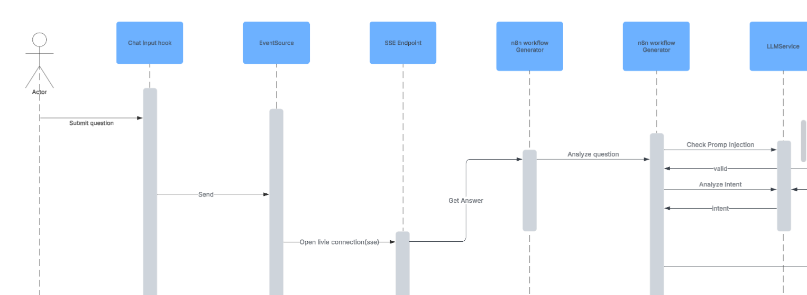
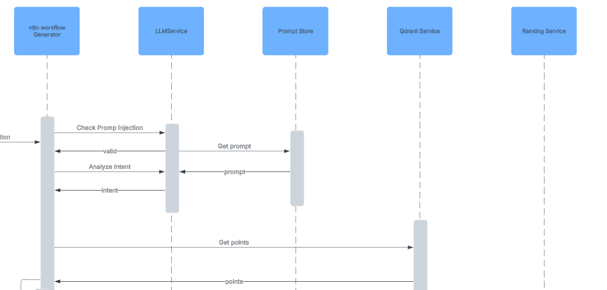

<h1 align="center"><strong>FlowPilot</strong></h1>

  

  <strong>
    Flowpilot is a one of a kind n8n workflow generator.Generation of production ready, deployable and testable workflows is what Flowpilot strives in.
  </strong>

<h2 align="center"><strong>Architecture</strong></h2>

<table align="center">
  <tr>
    <td align="center" width="50%">
      
      
<strong>Frontend</strong>

      
React

    </td>
    <td align="center" width="50%">
        
      
<strong>Backend</strong>

      
Laravel

    </td>
  </tr>
</table>
<h3 align="center"><strong>Communication Flow</strong></h3>

  

  <em>
    High-level data flow between the frontend, backend and database.
  </em>

  

  <em>
    n8n Generation workflow between the frontend, backend, generation module, LLM, vector-db and an open SSE connection.
  </em>

<h2 align="center"><strong>System Design</strong></h2>

<h3>Sequence Diagram</h3>
<table>
  <tr>
    <td align="center" width="100%">
      
      
<strong>Frontend</strong>

      
React

    </td>
    <td align="center" width="100%">
        
      
<strong>Backend</strong>

      
Laravel

    </td>
  </tr>
    <tr>
    <td align="center" width="100%">
      
      
<strong>Frontend</strong>

      
React

    </td>
    <td align="center" width="100%">
        
      
<strong>Backend</strong>

      
Laravel

    </td>
  </tr>
</table>
<h3>ER Diagram</h3>

  

