<image src="./readme/cards/title.svg"/>
<br/>
<br/>

<h1>License</h1>


<p>This project is licensed under the <a href="LICENSE">MIT License</a>.</p>

<br/>
<br/>


<image src="./readme/cards/projectOverview.svg"/>
<br/>
<br/>
<p>
  <strong>
    Flowpilot is a one of a kind n8n workflow generator.Generation of production ready, deployable and testable workflows is what Flowpilot strives in.Flowpilot helps coders
    and none coders alike.Its designed to specifically understand your intent and translate it
    into a production ready workflow.
  </strong>
</p>
<br/>


<br/>
<image src="./readme/cards/systemDesign.svg"/> 
<br/>
<br/>

<h3 align="center"><strong>General Communication Flow</strong></h3>
<p align="center">
  
</p>
<p align="center">
  <em>
    High-level data flow between the frontend, backend and database.
  </em>
</p>
<br/>
<br/>
<h3 align="center"><strong>Copilot Communication Flow</strong></h3>
<p align="center">
  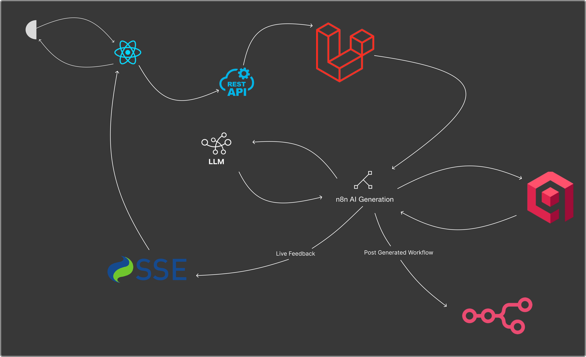
</p>
<p align="center">
  <em>
    n8n Generation workflow between the frontend, backend, generation module, LLM, vector-db and an open SSE connection.
  </em>
</p>

<h3>ER Diagram</h3>

 
<br/>
<br/>
<br/>
<image src="./readme/cards/projectHighlights.svg"/>
<h3></h3>

<p align="center">
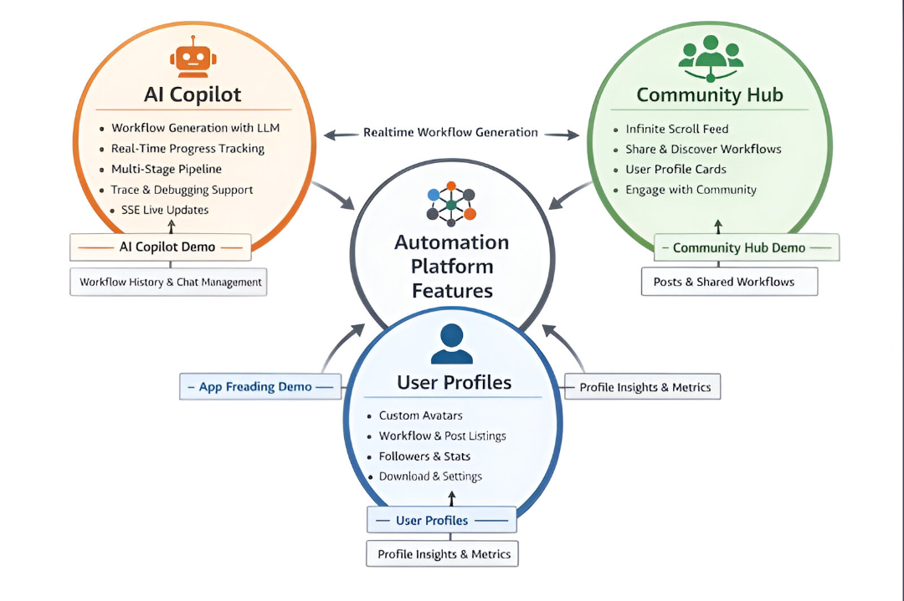
</p>
<h2>Main Features</h2>
<div style="display: flex; flex-direction: column; gap: 40px; margin: 30px 0;">
  <div style="display: flex; align-items: center; gap: 30px;">
    <div style="flex: 1;">
      <h3 style="margin-top: 0; color: #ffffff;">AI Copilot</h3>
      <p style="margin-bottom: 12px;">An intelligent workflow generation assistant that uses LLM technology to understand user intent and automatically generate production-ready n8n workflows.</p>
      <ul style="margin: 0; padding-left: 20px;">
        <li>Real-time streaming workflow generation with progress tracking</li>
        <li>Multi-stage generation pipeline with user feedback</li>
        <li>Workflow history and chat management</li>
        <li>Trace and debugging support for generated workflows</li>
        <li>Server-sent events (SSE) connection for live updates</li>
      </ul>
    </div>
  </div>
  <div style="display: flex; align-items: center; gap: 30px;">
    <div style="flex: 1;">
      <h3 style="margin-top: 0; color: #ffffff;">Community Hub</h3>
      <p style="margin-bottom: 12px;">A collaborative platform for automation builders to share workflows, tips, and integrations with the n8n community.</p>
      <ul style="margin: 0; padding-left: 20px;">
        <li>Infinite scroll feed of community posts and workflows</li>
        <li>Create and share posts with the community</li>
        <li>Browse and discover shared workflows by other users</li>
        <li>User profile cards with avatar and metadata</li>
        <li>Engage with other builders in the n8n ecosystem</li>
      </ul>
    </div>
  </div>
  <div style="display: flex; align-items: center; gap: 30px;">
    <div style="flex: 1;">
      <h3 style="margin-top: 0; color: #f8f8f8;">User Profiles</h3>
      <p style="margin-bottom: 12px;">Comprehensive user profile system with detailed information and engagement statistics across the platform.</p>
      <ul style="margin: 0; padding-left: 20px;">
        <li>Customizable avatars and profile pictures</li>
        <li>Display user workflows and community posts</li>
        <li>View follower and following lists</li>
        <li>Track engagement metrics (likes, imports on workflows/posts)</li>
        <li>Manage profile settings and preferences</li>
        <li>Download workflow content and history</li>
      </ul>
    </div>
  </div>
</div>
<br/>
<br/>
<br/>
<image src="./readme/cards/demo.svg"/>
<br/>
<br/>
<h1>Landing</h1>
<table>
  <tr>
    <td align="center" width="50%">
      
    </td>
    <td align="center" width="50%">
      
    </td>
  </tr>
</table>
<br/>
<br/>
<h1>Login</h1>
<table>
  <tr>
    <td align="center" width="50%">
      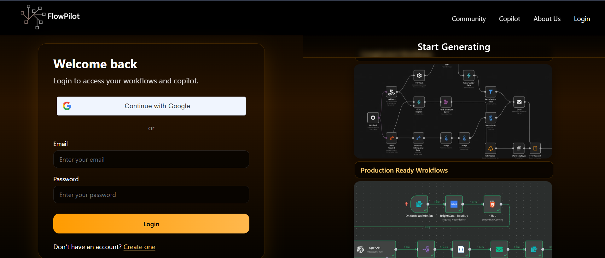
    </td>
    <td align="center" width="50%">
      
    </td>
  </tr>
</table>
<p align="center">
  
</p>
<br/>
<br/>
<h1>Signup</h1>
<table>
  <tr>
    <td align="center" width="50%">
      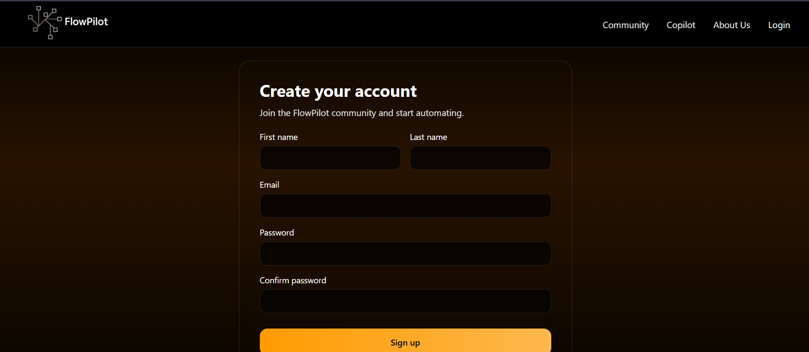
    </td>
    <td align="center" width="50%">
      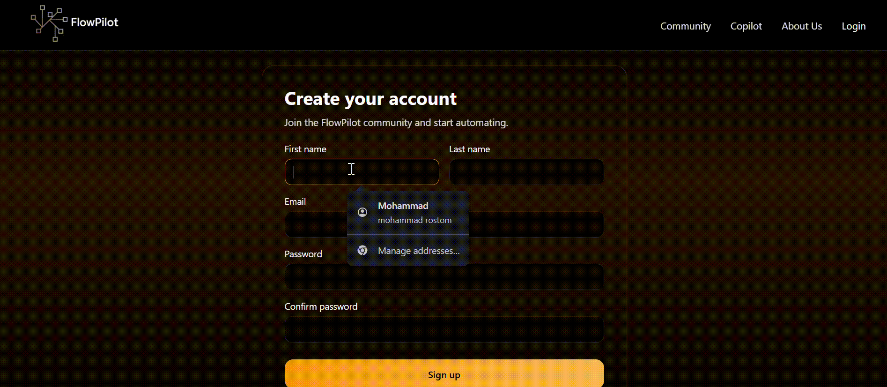
    </td>
  </tr>
</table>
<p align="center">
  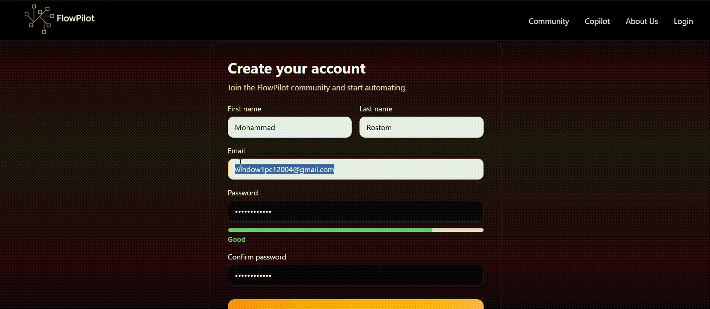
</p>
<br/>
<br/>

<h1>Copilot</h1>
<h3>Simple workflow generation</h3>

<table>
  <tr>
    <td align="center" width="50%">
      
    </td>
    <td align="center" width="50%">
      
    </td>
  </tr>
</table>

<br/>

<h3>Complicated workflow generation</h3>

<table>
  <tr>
    <td align="center" width="50%">
      
    </td>
    <td align="center" width="50%">
      
    </td>
  </tr>
</table>
<br/>
<br/>
<h1>Community Hub</h1>
<table>
  <tr>
    <td align="center" width="50%">
      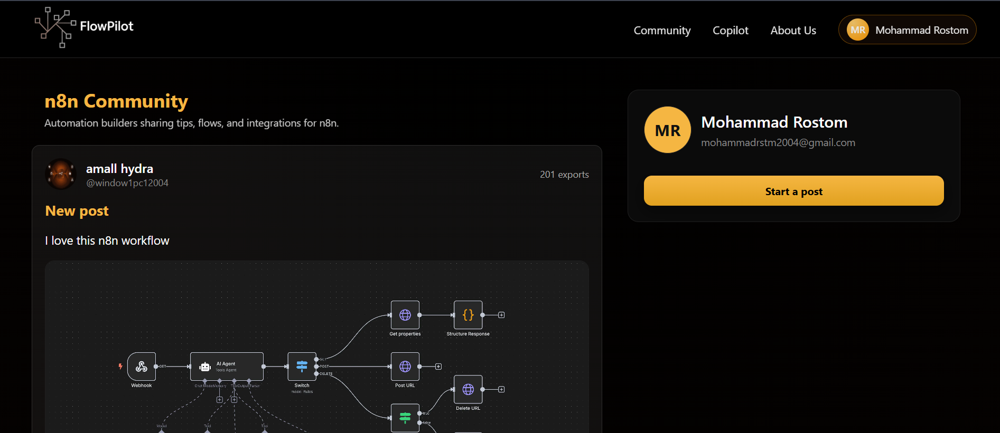
    </td>
    <td align="center" width="50%">
      
    </td>
  </tr>
</table>
<br />
<br />
<h1>Profile</h1>
<table>
  <tr>
    <td align="center" width="50%">
      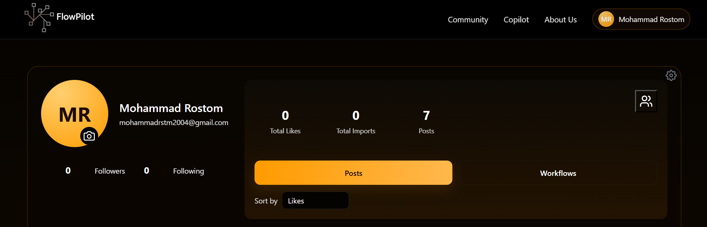
    </td>
    <td align="center" width="50%">
      
    </td>
  </tr>
</table>
<br />
<br />
<h1>Settings</h1>
<table>
  <tr>
    <td align="center" width="50%">
      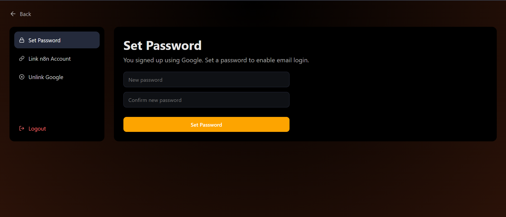
    </td>
    <td align="center" width="50%">
      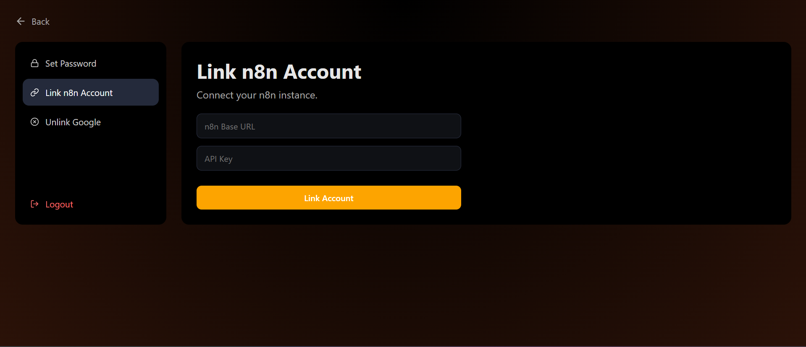
    </td>
  </tr>
</table>
<table>
  <tr>
    <td align="center" width="50%">
      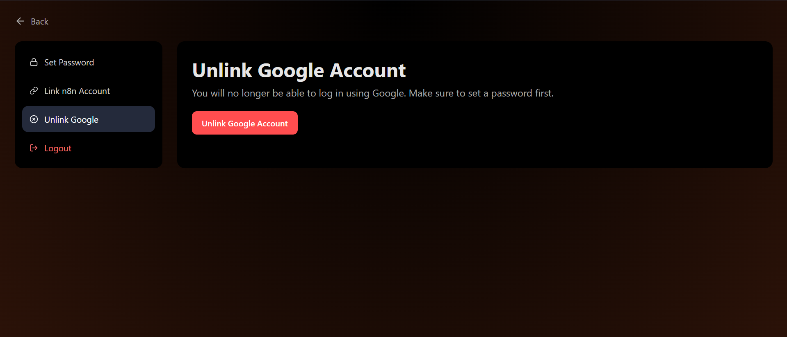
    </td>
    <td align="center" width="50%">
      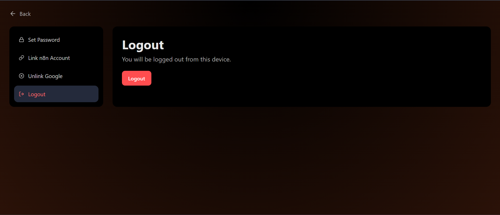
    </td>
  </tr>
</table>
<br />
<br />
<br />
<image src="./readme/cards/developmentAndTesting.svg"/>
<br />
<br />
<p>This project was built using a test-driven and validation-first mindset.
Every major feature was developed alongside tests to ensure reliability, prevent regressions, and maintain production-grade stability as the system evolved.</p>
<br />
<br />

<h1>Frontend</h1>
<table>
  <tr>
    <th align="center" width="33%">Folder Structure</th>
    <th align="center" width="33%">Centralized Error Handler</th>
    <th align="center" width="33%">API Interceptor</th>
  </tr>
  <tr>
    <td align="center">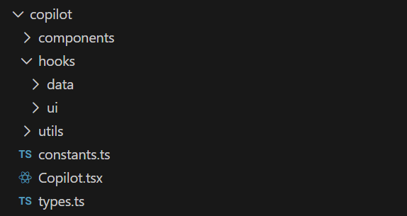</td>
    <td align="center">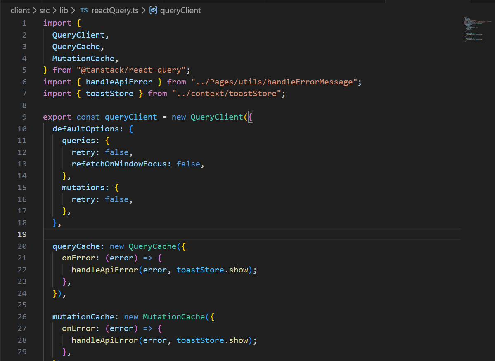</td>
    <td align="center">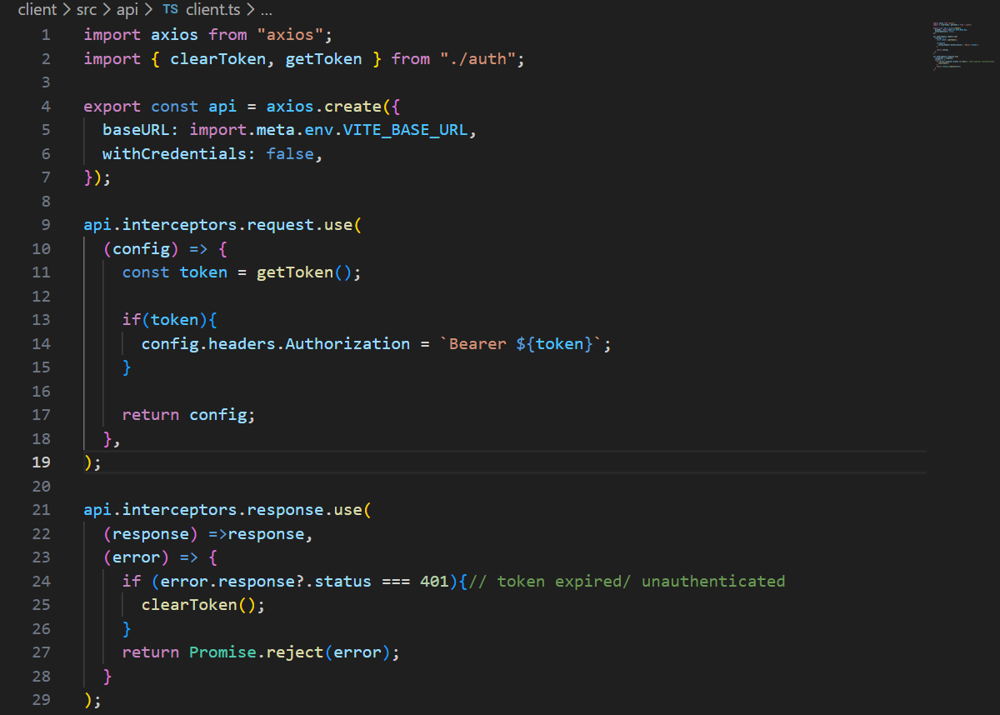</td>
  </tr>
</table>

<h1>Backend</h1>
<table>
  <tr>
    <th align="center" width="33%">Controller</th>
    <th align="center" width="33%">Service</th>
    <th align="center" width="33%">Centralized Error Handler</th>
  </tr>
  <tr>
    <td align="center">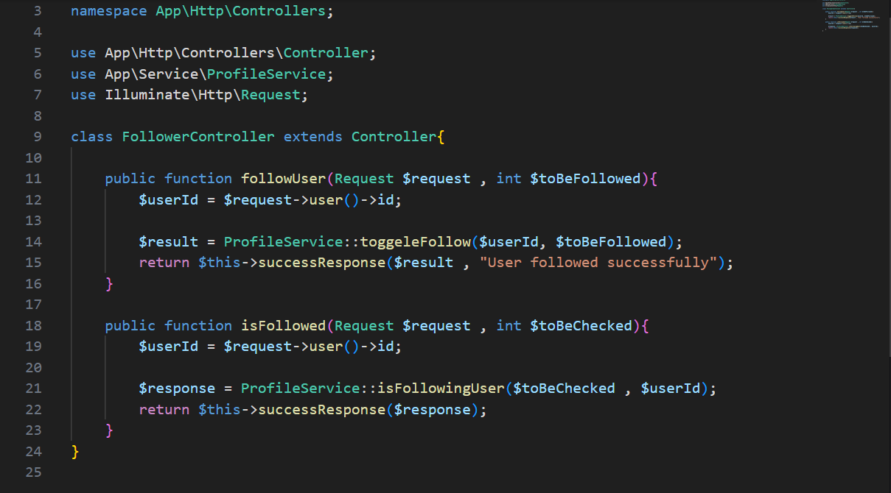</td>
    <td align="center">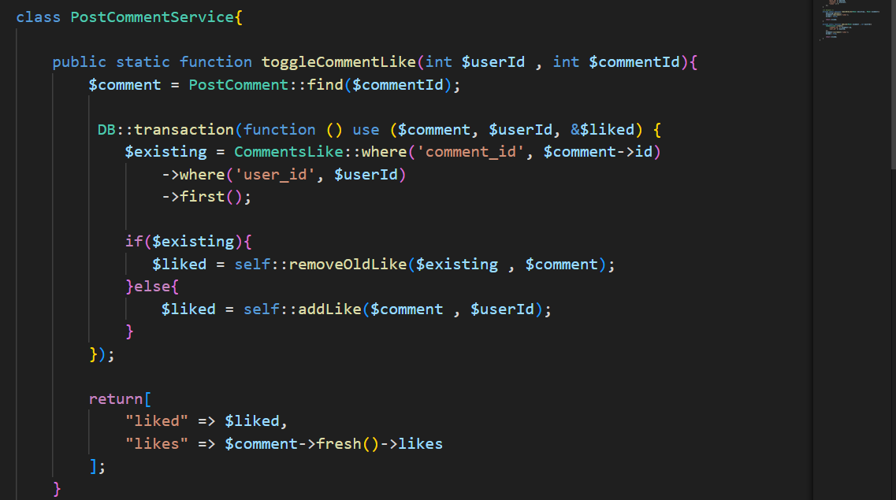</td>
    <td align="center"></td>
  </tr>
</table>
<br />
<br />
<br />
<h1>Github Actions</h1>

<br />
<br />
<h1>Git Philosophy </h1>
<p align="center">
  This project follows a structured Git workflow designed to keep the codebase clean,
  scalable, and production-ready at all times.
</p>

<br/>

<h3>Branching Model</h3>

<table align="center">
  <tr>
    <th>Branch</th>
    <th>Purpose</th>
  </tr>
  <tr>
    <td><strong>main</strong></td>
    <td>Production-ready, always stable and deployable</td>
  </tr>
  <tr>
    <td><strong>dev</strong></td>
    <td>Integration branch where completed features are merged</td>
  </tr>
</table>

<p align="center"><em>No direct commits are made to <strong>main</strong>.</em></p>

---

<h3>Branch Types</h3>

<p>All work is created from <strong>dev</strong> using task-based branches:</p>

<table align="center">
  <tr>
    <th>Prefix</th>
    <th>Usage</th>
  </tr>
  <tr><td><code>feature/</code></td><td>New features</td></tr>
  <tr><td><code>fix/</code></td><td>Bug fixes</td></tr>
  <tr><td><code>hotfix/</code></td><td>Urgent production fixes</td></tr>
  <tr><td><code>refactor/</code></td><td>Code improvements</td></tr>
  <tr><td><code>chore/</code></td><td>Tooling, config, dependencies</td></tr>
  <tr><td><code>docs/</code></td><td>Documentation updates</td></tr>
</table>

<p><strong>Naming format:</strong> <code>type/short-description</code></p>

Examples:
```bash
feature/user-auth
fix/login-validation
refactor/api-layer
docs/readme-update
```

---
<br />
<br />
<h1>Tests</h1>
<h3>Feature tests</h3>
<div style="background-color: #000000; padding: 20px; border-radius: 8px; overflow-y: auto; margin: 20px 0; max-height: 600px;">
  <div style="display: flex; flex-direction: column; gap: 20px;">
    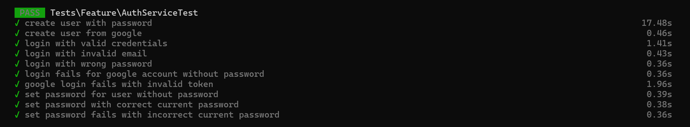
    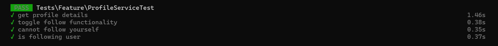
    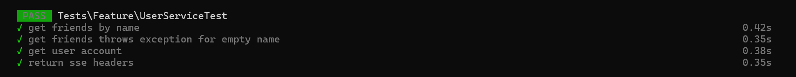
    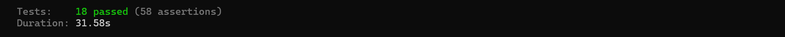
  </div>
</div>


<h3>Unit tests</h3>

<div style="background-color: #000000; padding: 20px; border-radius: 8px; overflow-y: auto; margin: 20px 0; max-height: 600px;">
  <div style="display: flex; flex-direction: column; gap: 20px;">
    <!-- 
    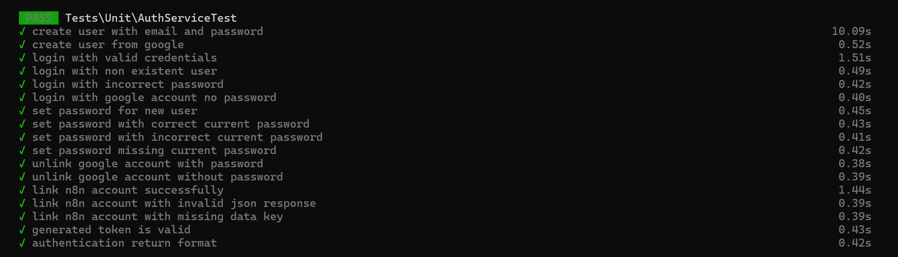
    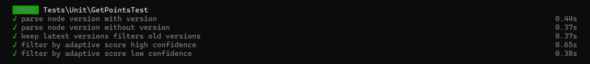
    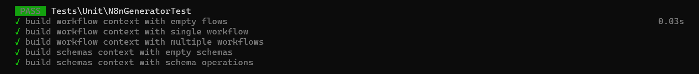
    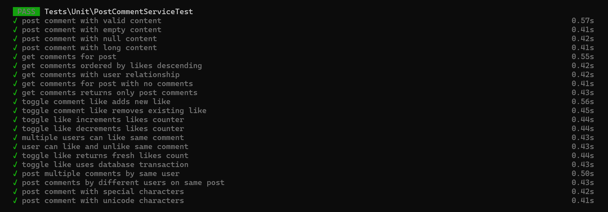
    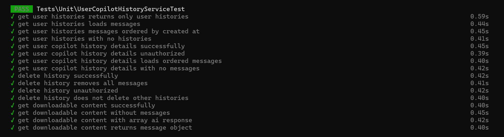
    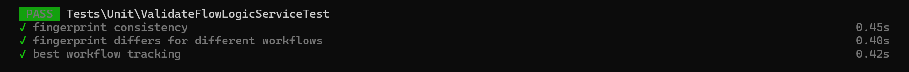 -->
    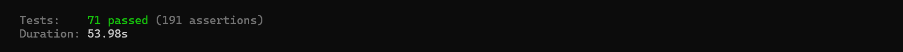
  </div>
</div>

<br />